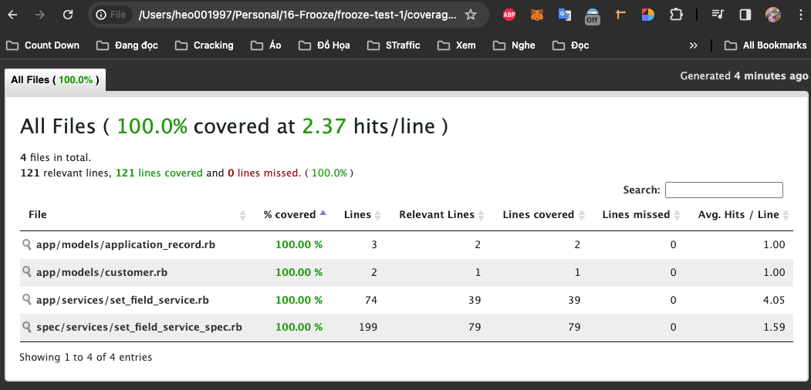

# README

### This is my thought process: https://foul-sovereign-1c2.notion.site/Frooze-Test-1-f366e21f3f8f471180f70fbb503adc4c

 I tried to refactor the service, and re-test with 100 pass coverage. Execept this time, I don't try to refactor without permission, don't worry 😅.

### Coverage:



### Rspec result log with document format:

```
 ~/Personal/16-Frooze/frooze-test-1 │ main +89  rspec --format d                                                                                                               ✔ │ 2.7.2  │ 01:03:37 PM 
DEPRECATION WARNING: TestFixtures.fixture_path= is deprecated and will be removed in Rails 7.2. Use .fixture_paths= instead. (called from <top (required)> at /Users/heo001997/Personal/16-Frooze/frooze-test-1/spec/services/set_field_service_refactored_spec.rb:3)
DEPRECATION WARNING: TestFixtures.fixture_path= is deprecated and will be removed in Rails 7.2. Use .fixture_paths= instead. (called from <top (required)> at /Users/heo001997/Personal/16-Frooze/frooze-test-1/spec/services/set_field_service_spec.rb:3)

SetFieldService
  should save customer {field} success
    with valid email
      return service with empty hash, correct email, verified false
    with valid first_name
      return service with empty hash, correct first_name
    with valid last_name
      return service with empty hash, correct last_name
    with valid phone
      return service with empty hash, correct phone
    with valid title
      return service with empty hash, correct title
    with valid role
      return service with empty hash, correct role
    with valid score
      return service with empty hash, correct score
  should update customer failed
    with blank email
      return correct error
    with invalid email format
      return correct error
    with existed email
      return correct error
    with valid mail but unexpected exception happen
      return correct error
    with invalid/unknown field
      return correct error

SetFieldService
  should save customer {field} success
    with valid email
      return service with empty hash, correct email, verified false
    with valid first_name
      return service with empty hash, correct first_name
    with valid last_name
      return service with empty hash, correct last_name
    with valid phone
      return service with empty hash, correct phone
    with valid title
      return service with empty hash, correct title
    with valid role
      return service with empty hash, correct role
    with valid score
      return service with empty hash, correct score
  should update customer failed
    with blank email
      return correct error
    with invalid email format
      return correct error
    with existed email
      return correct error
    with valid mail but unexpected exception happen
      return correct error
    with invalid/unknown field
      return correct error

Finished in 0.14062 seconds (files took 1.44 seconds to load)
24 examples, 0 failures

Coverage report generated for RSpec to /Users/heo001997/Personal/16-Frooze/frooze-test-1/coverage. 121 / 121 LOC (100.0%) covered.

 ~/Personal/16-Frooze/frooze-test-1 │ main +90 !3                                                                                                                              ✔ │ 2.7.2  │ 01:09:35 PM
```
